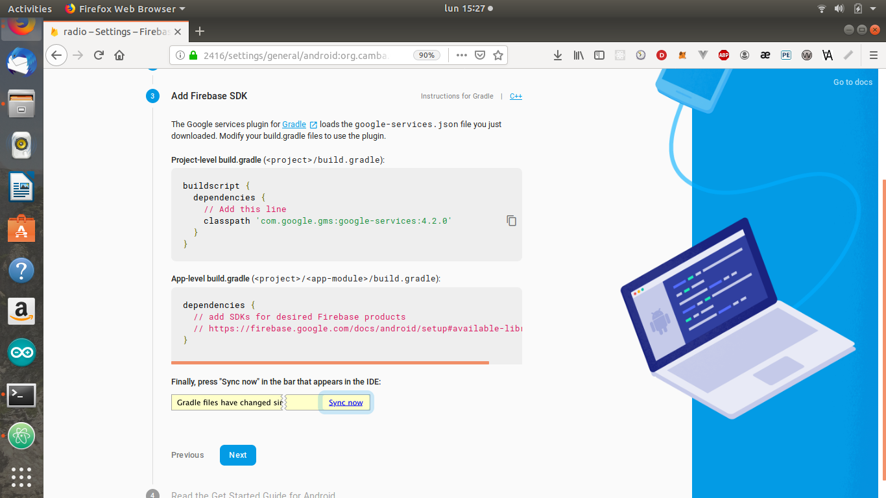

## Firebase Cloud Message

* It's necessary to have a [Google account](https://accounts.google.com/signup/v2/webcreateaccount?service=ahsid&continue=https%3A%2F%2Ffirebase.google.com%2F%3Frefresh%3D1&flowName=GlifWebSignIn&flowEntry=SignUp).

* Go to [firebase console](https://console.firebase.google.com/)

* Add the proyect

* Add the proyect name and continue.

* Create proyect

* Continue

* To add Firebase to your Android Application press the Android icon.

* Android package name (application id): `org.camba.radio`.
* Register app

* Download `google-services.json` file.

* Copy `google-services.json` file in `ns-vue-radio/app/App_Resources/Android/`

* [Add nativescript-plugin-firebase](Guia-para-agregar-nativescript-plugin-firebase.md)

* Run commands below:

`npm install`

`npm run clean`

`tns build android --bundle`

`tns run android --bundle`

* Once the application initialises you're registered in Firebase

* Go to `Console>Grow>Cloud Messaging` and press **Send your first message**

* Write notification title and content

* Next

* Topic

* Select the tab to open the app when recived the notification.

* Select a date to send the notification

* In custom data set *topic* as **key** and the tab to open app as **value**

* Click the Review button

* Click the Publish button

* And the notification will be send.

