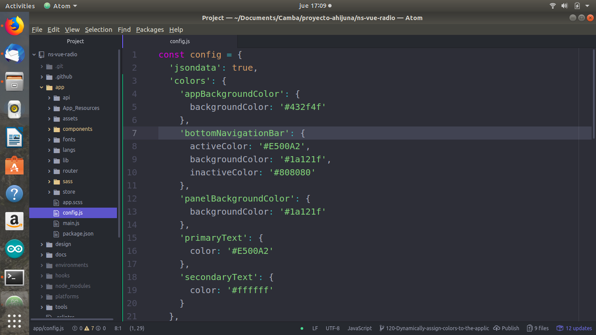
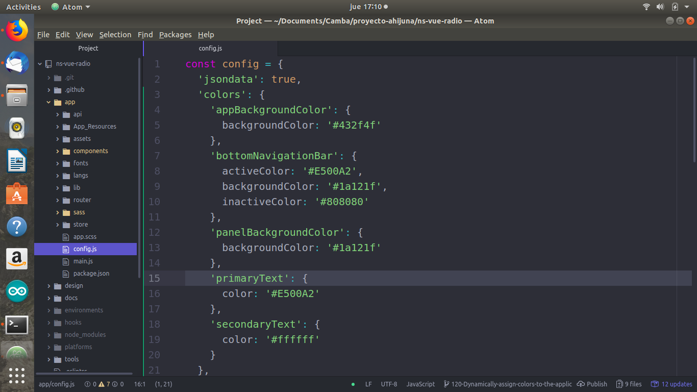

## How to change app colors

* Go to `app/config`

* From here you can change the app background color by changing the value of `appBackgroundColor`

* You can change the app panel background color by changing the value of `panelBackgroundColor`

* You can change the app panel icon background color by changing the value of `bottomNavigationBar`

* You can change the app primary text color by changing the value of `primaryTextColorApp`

* And finally, you can change the app secondary text color by changing the value of `primaryText`

