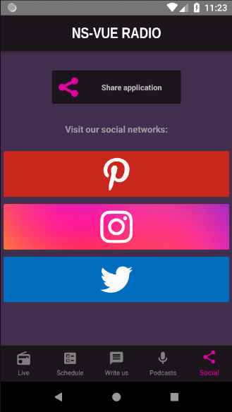

## How to choose the app social networks

* Go to `app/config.js`


* Remove the sections that your app not use


* Add the sections that need your app

  - Go to [Social Icon](http://www.socicon.com/chart.php)

  - Search the icon social network


  - Put a json with this fields:
```
  {
    link2App: '<link-to-open-app-social-network>'
    link2Page: '<link-to-open-page-social-network>'
    iconId: '#\u<icon-id>'
    iconColor: '#<rgb-code-icon-color>'
    background: '#<rgb-code-background-color>'
  }
```




* Or use a background image
  - Put a background image


  - Use the field 'backgroundImage':
```
  {
    link2App: '<link-to-open-app-social-network>'
    link2Page: '<link-to-open-page-social-network>'
    iconId: '#\u<icon-id>'
    iconColor: '#<rgb-code-icon-color>'
    backgroundImage: '~/<path-to-image-from-"app/">'
  }
```


