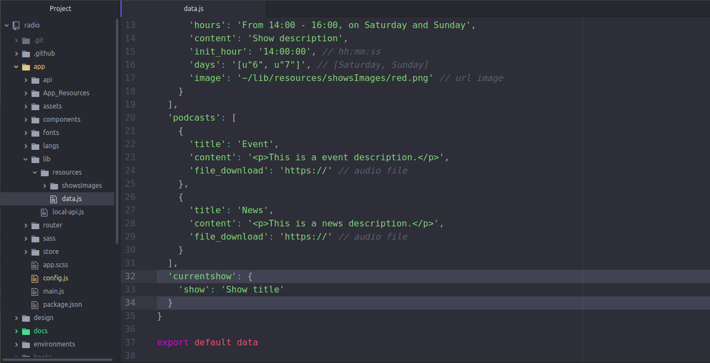

## How to configure your data source

  * First step put your radio's stream.

    - Go to `app/config.js` and set your radio's stream in `stream` field


#### You could use the local API

  * Go to `app/lib/resources/data.js`


  * And configure the file with your data.
    - In *shows* field, set your schedule data.
      + `title`: this field is to set the show's title.
      + `hours`: this is to set the legible hours, because this is visible in the schedule section.
      + `content`: this is the show's description
      + `init_hour`: here set the init hour, only for sort the programs in format hh:mm:ss
      + `days`: here set the days that is live-on
      + `image`: here set the url to program image


    - In *podcasts* field, set your podcasts' data(ex. news, events, shows or pices of shows).
      + `title`: here set podcast's topic.
      + `content`: this is the podcast description.
      + `file_download`: this is the url to download the podcast audio file.

    - In *currentShow* field, set the current show title.
      + `show`: here set the current show.


#### Or configure to use your own API

  * Go to `app/config.js`

  * Replace *jsondata* field value from `true` to `false`


  * Create the enviroments/development.json and enviroments/production.json files.

  * Set an appropiate API url for each file:

```JSON
{
  "API_URL": "your-lan-ip"
}
```

  * Your API should have the following url:
    - `<url's API>/shows/currentShow`, here the `.status` field, seted in `200` to verify connection and `.data` with the field:
      + `show`: here set the current show.
    - `<url's API>/shows/api`, here the `.status` field, seted in `200` to verify connection and `.data` with the programs' list. For each program a json, with the fields:
      + `title`: this field is to set the show's title.
      + `hours`: this is to set the legible hours, because this is visible in the schedule section.
      + `content`: this is the show's description
      + `init_hour`: here set the init hour, only for sort the programs in format hh:mm:ss
      + `days`: here set the days that is live-on
      + `image`: here set the url to program image
    - `<url's API>/podcasts/api/?limit=<pagination number>` to select the 30 last podcasts. `<url's API>/podcasts/api` here `.data.results` with the podcasts' list. For each podcast a json, with the fields:
      + `title`: here set podcast's topic.
      + `content`: this is the podcast description.
      + `file_download`: this is the url to download the podcast audio file.
