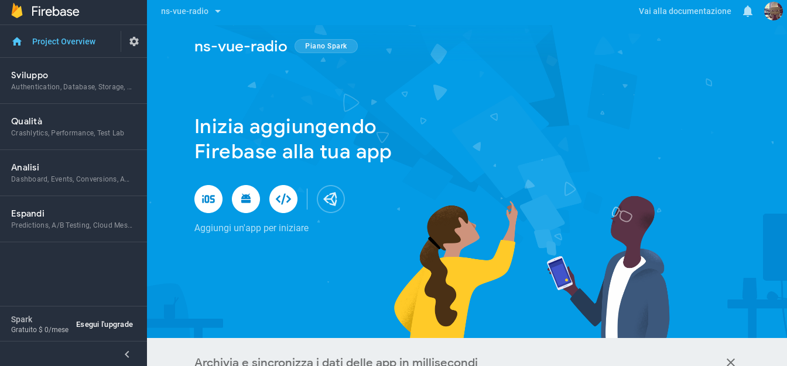
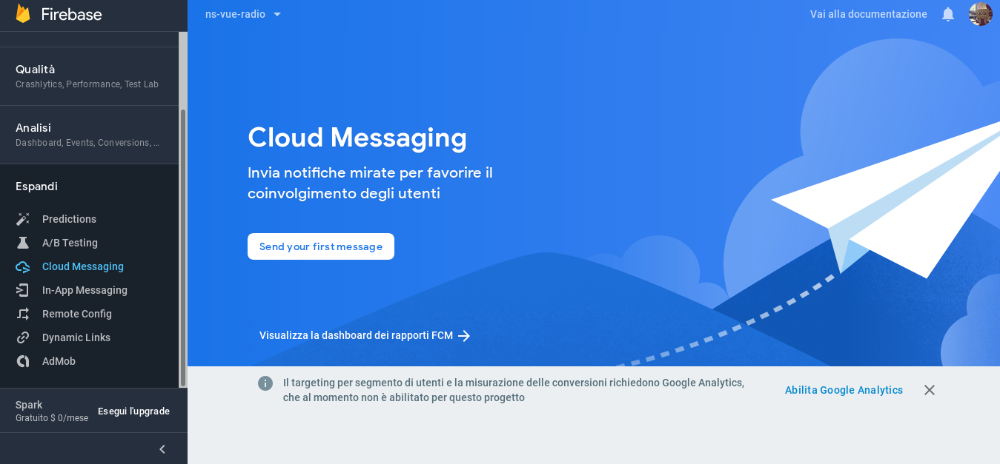
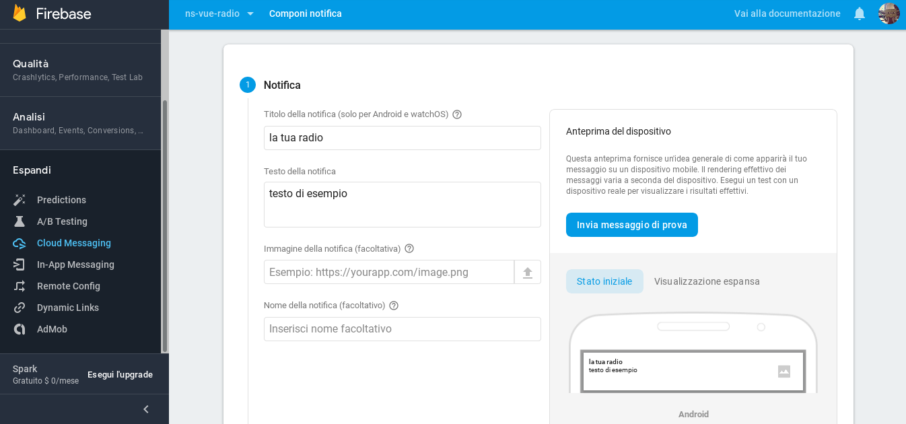

## Firebase Cloud Message

* È necessario un [account Google](https://accounts.google.com/signup/v2/webcreateaccount?service=ahsid&continue=https%3A%2F%2Ffirebase.google.com%2F%3Frefresh%3D1&flowName=GlifWebSignIn&flowEntry=SignUp)

* Andare sulla [console](https://console.firebase.google.com/)

* Aggiungere un progetto

* Inserisci il nome del progetto e accetti i termini di Firebase

* Continuare e scogli si vuoi fare la configurazione di Google Analytics:

* Quando é stato presto il progetto, aggiungi l'applicazione android:

* Nome del pacchetto android (id dell'applicazione): `org.camba.radio`
* Registrare l'applicazione

* Scaricare il file `google-services.json`

* Eseguire il comando:

`git clone http://gitlab.camba.coop/camba/ns-vue-radio.git ns-vue-radio`

* Copiare il file:

`google-services.json`

in

`ns-vue-radio/app/App_Resources/Android/`

* [Aggiungere nativescript-plugin-firebase](Guia-para-agregar-nativescript-plugin-firebase_it.md)

* Eseguire i comandi:

`npm install`

`npm run clean`

`tns build android --bundle`

`tns run android --bundle`

* Una volta avviata l'applicazione e registrato Firebase

* Andare su Console>Espandi>Cloud Messaging

* Scrivi il titolo ed il testo della notifica

* Selezioni l'applicazione

* In opzioni aggiuntive>dati personalizzati dove dice "chiave" scrivere "topic" e dove dice "valore" scrivere il nome del canale che si desidera mostrare dopo avere visualizzato il messaggio nell'applicazione (live, programmazione, script, podcast, reti)

* Vedremo questo annuncio perche non avvete ancora suscriti alle notfica. Ignoralo e avvia l'applicazione

