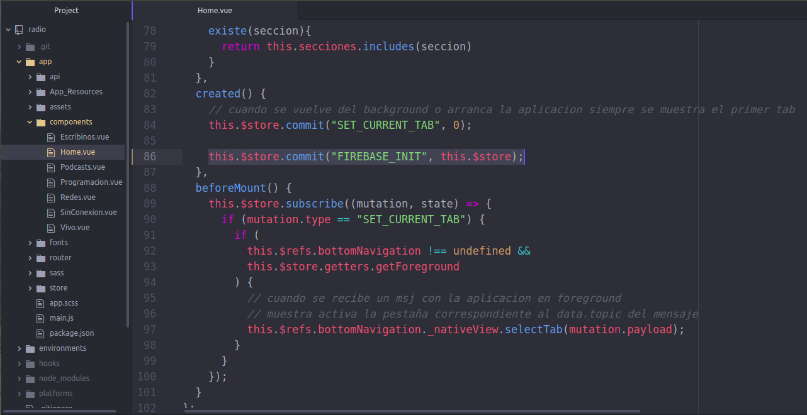

## Firebase Cloud Message

#### Per aggiungere il plugin Firebase Cloud Message all'aplicazione della radio devi:

* Eseguire il comando

`npm install nativescript-plugin-firebase`

* Modificare nel file `package.json` la versione di nativescript-plugin-firebase, per la versione "9.0.4"

* Andare nel file `app/components/Home.vue`
  - decommentare la riga `// this.$store.commit("FIREBASE_INIT", this.$store);`

* Andare nel file `app/store/index.js`
  - decommentare la riga `import firebase from 'nativescript-plugin-firebase'`

  - modificare la riga `firebase: null, //firebase,` in `firebase: firebase,`

Con questa procedura avremo aggiunto `nativescript-plugin-firebase`, rimane solo da configurare, se non si realizza la [configurazione](Firebase-configuration-guide_it.md) l'applicazione non funzionerà correttamente.
