## Firebase Cloud Message

* É necessário [uma conta no Google](https:/accounts.google.com/signup/v2/webcreateaccount?service=ahsid&continue=https%3A%2F%2Ffirebase.google.com%2F%3Frefresh%3D1&flowName=GlifWebSignIn&flowEntry=SignUp)

* Ir ao [console](https:/console.firebase.google.com/)

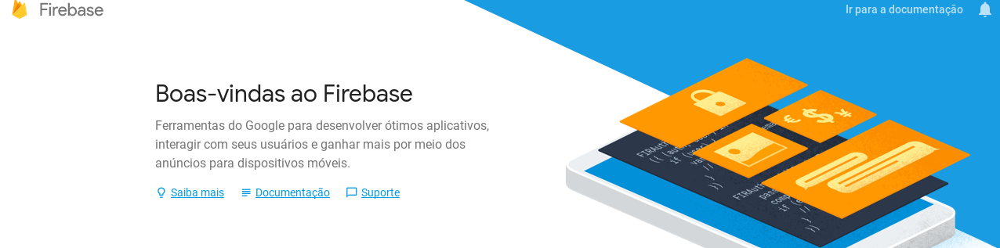

* Adiciona o projeto

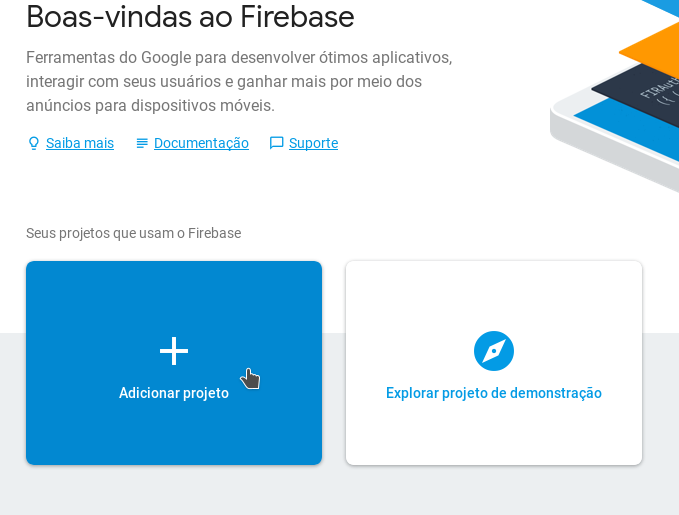
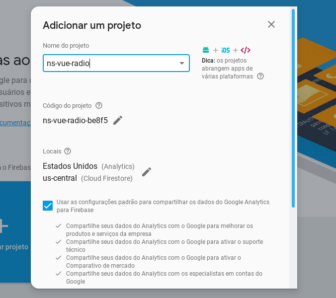

* Criar o projeto

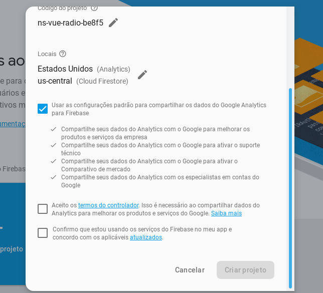

* Continuar

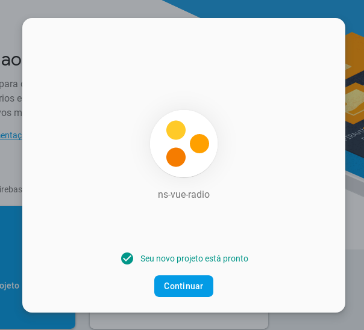

* Adicione uma aplicação android

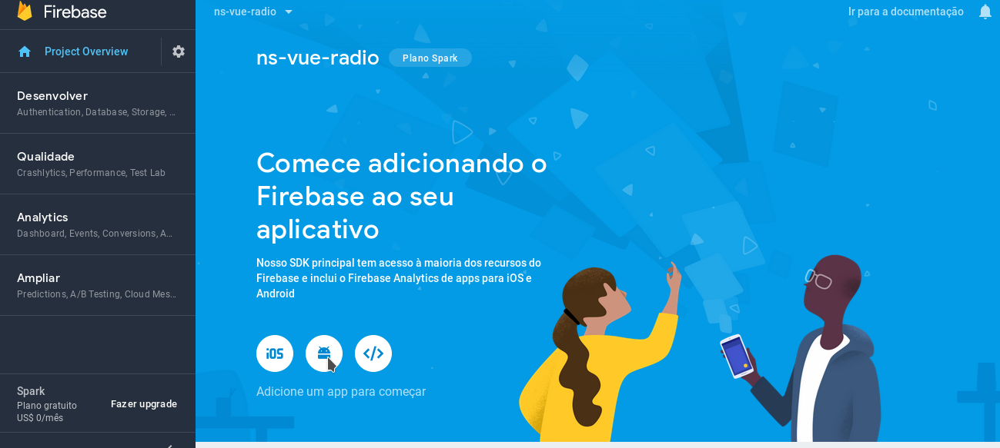

* Nome do pacote Android (ID do aplicativo): `org.camba.radio`
* Registrar a aplicação

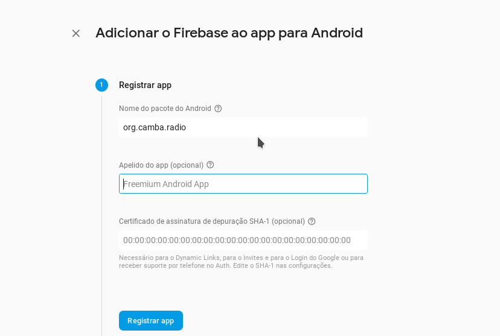

* Baixe o arquivo `google-services.json`

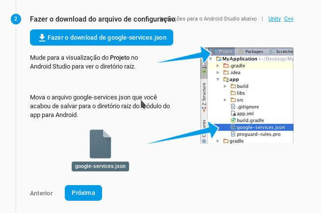

* Execute o comando:

`git clone http://gitlab.camba.coop/camba/ns-vue-radio.git ns-vue-radio`

* Copie o arquivo:

`google-services.json`

para

`ns-vue-radio/app/App_Resources/Android/`

* [Adicione o nativescript-plugin-firebase](Guia-para-agregar-nativescript-plugin-firebase.md)

* Execute os comandos:

`npm install`

`npm run clean`

`tns build android --bundle`

`tns run android --bundle`

* Uma vez que o aplicativo foi iniciado e o Firebase foi registrado:

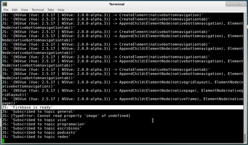
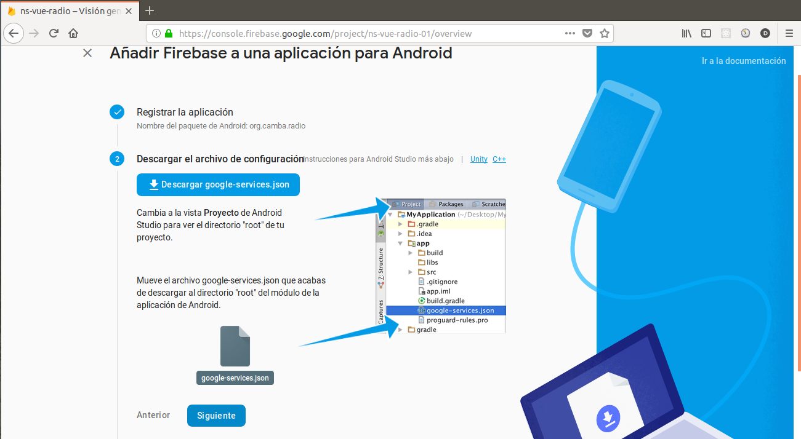
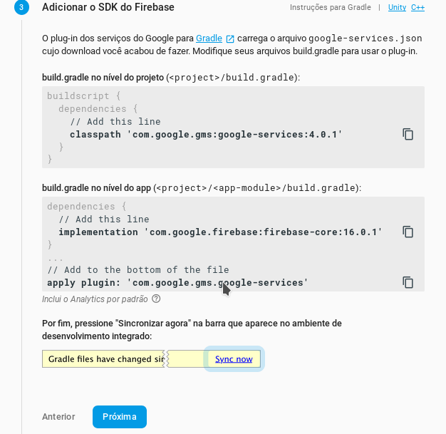
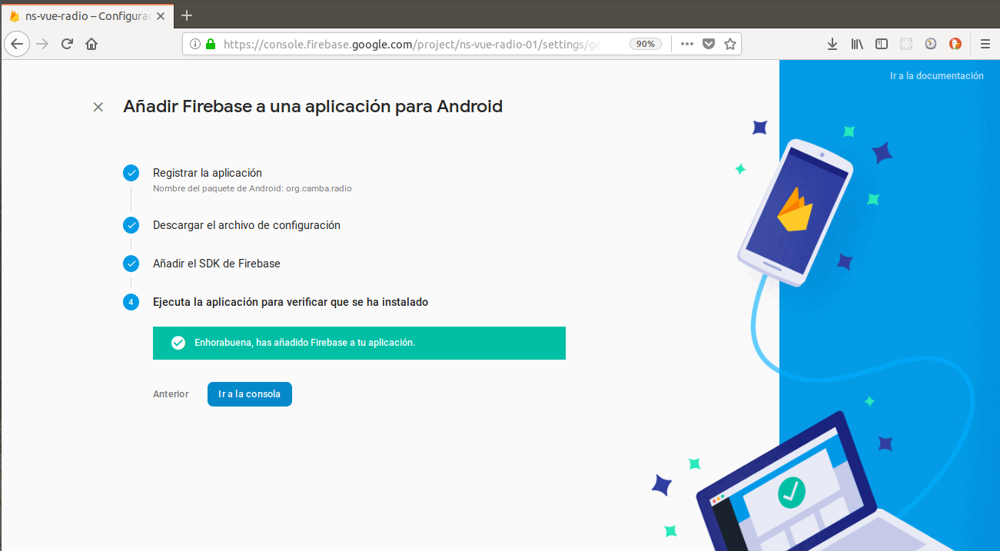

* Ir a Console>Crescimento>Cloud Messaging

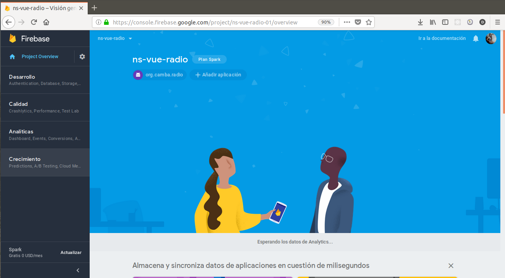
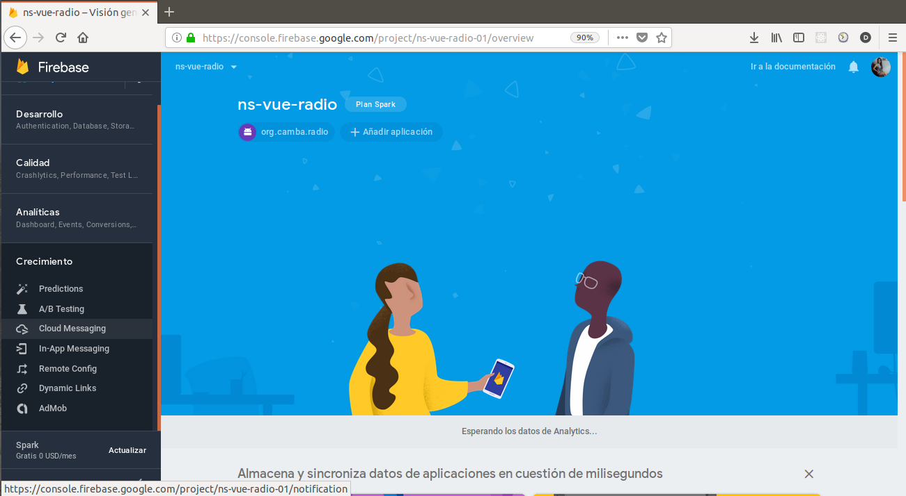
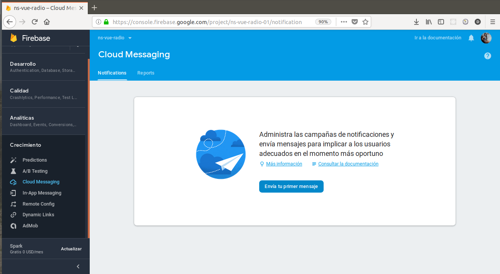

* Escreva o texto da mensagem

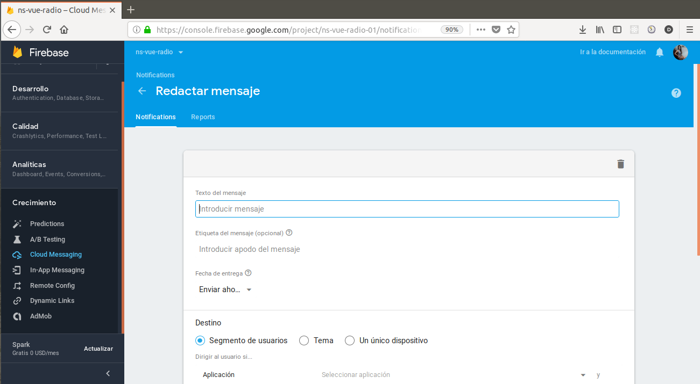

* Selecione o aplicativo

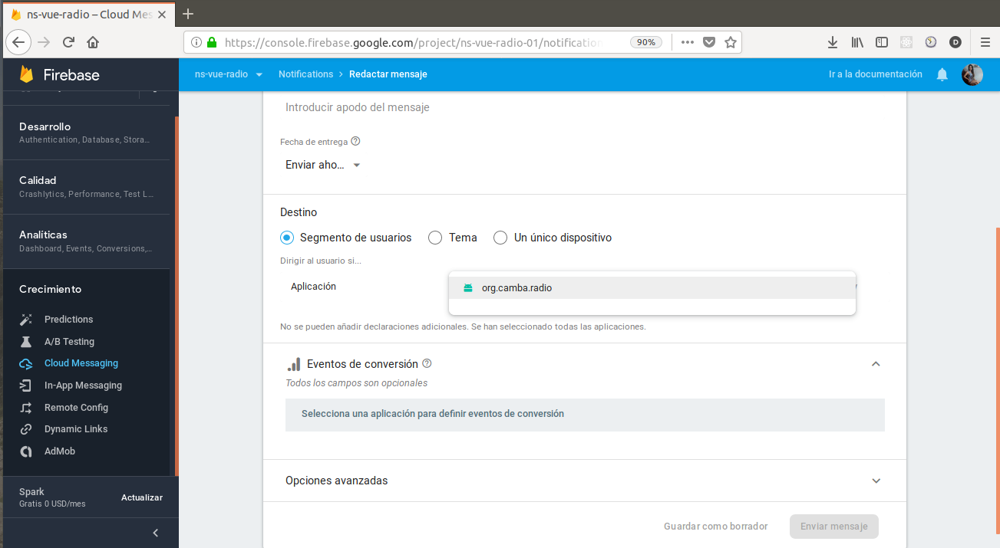

* Nas opções avançadas> dados personalizados

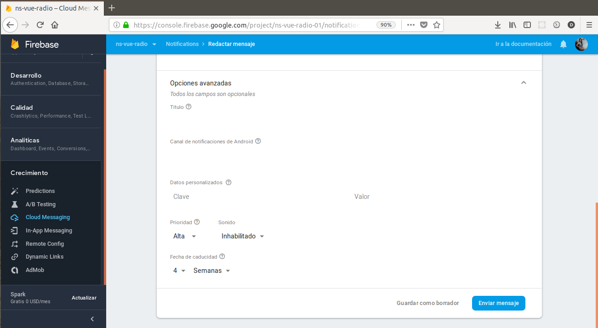

* Onde diz chave para escrever: tópico

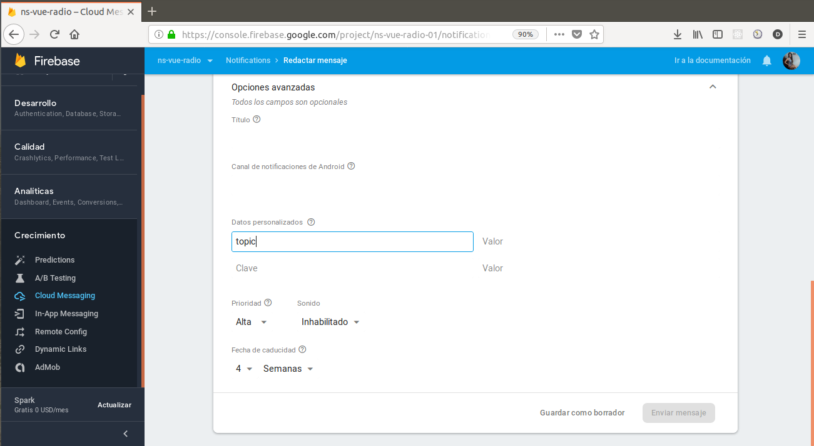

* Onde diz o valor escrever: o nome do canal que você deseja mostrar depois de visualizar o msg no aplicativo (ao vivo, programação, scripts, podcasts, redes)

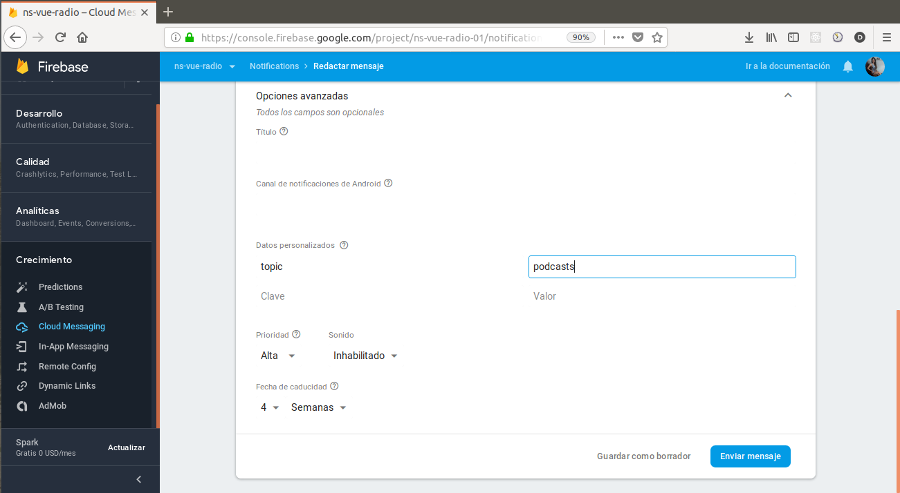

* Finalmente, enviamos nossa notificação

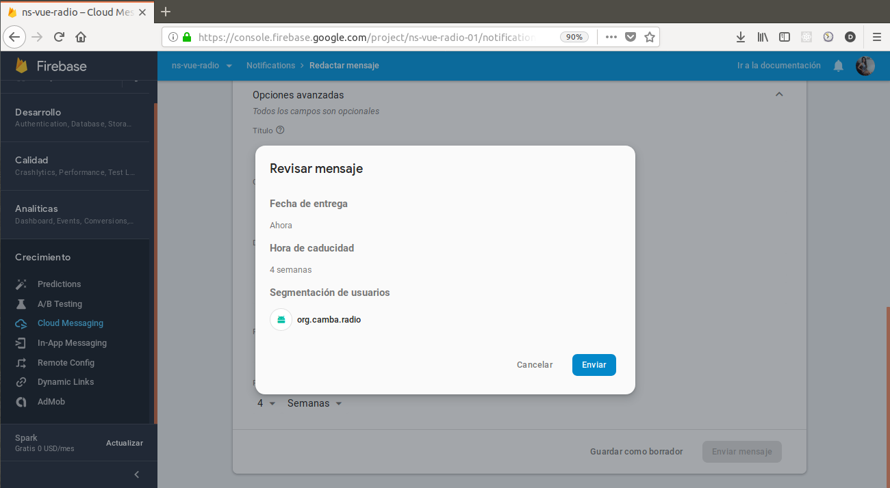
