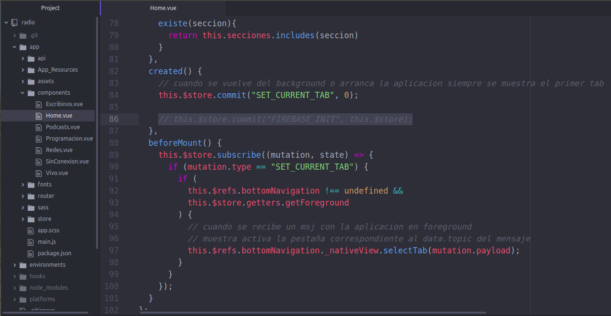

## Firebase Cloud Message

#### Para adicionar o plug-in do Firebase Cloud Message ao aplicativo de rádio, você precisa:

* Executar o Comando

`npm install nativescript-plugin-firebase`

* Modifique no arquivo `package.json` a versão do nativescript-plugin-firebase, pela versão" 7.1.

* Abrir o arquivo `app/components/Home.vue`
  - descomentar a linha `// this.$store.commit("FIREBASE_INIT", this.$store);`

* Abrir o arquivo `app/store/index.js`
  - descomentar a linha `import firebase from 'nativescript-plugin-firebase'`

  - modificar a linha `firebase: null, //firebase,` por `firebase: firebase,`

Com isso, teremos adicionado `nativescript-plugin-firebase`, só precisa configurá-lo, se a [configuração] (Guide-of-configuracion-de-firebase.md) não for feita, o aplicativo não funcionará corretamente.
