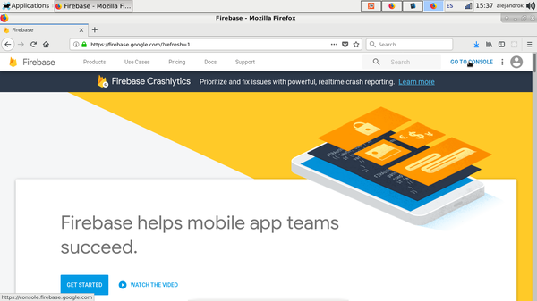
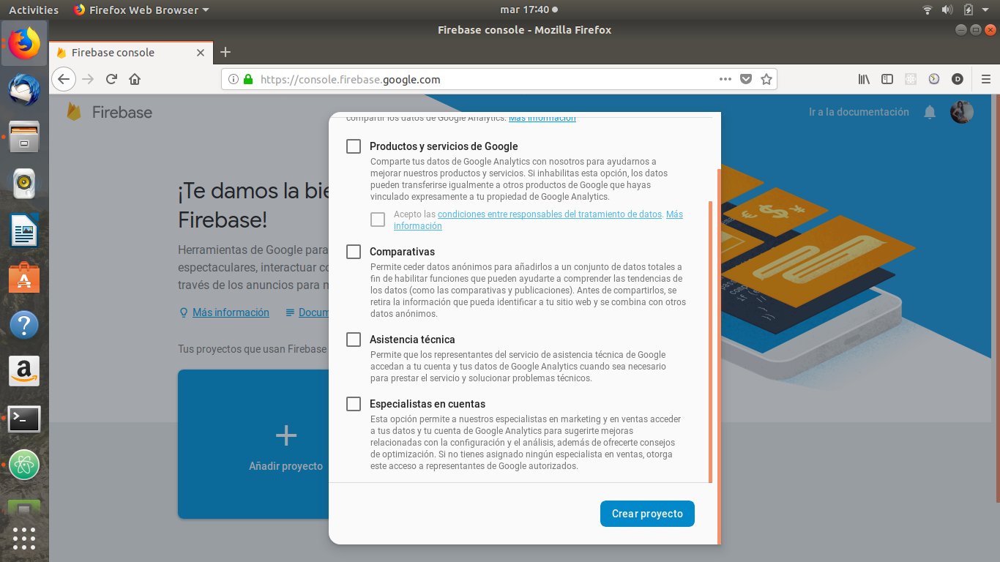
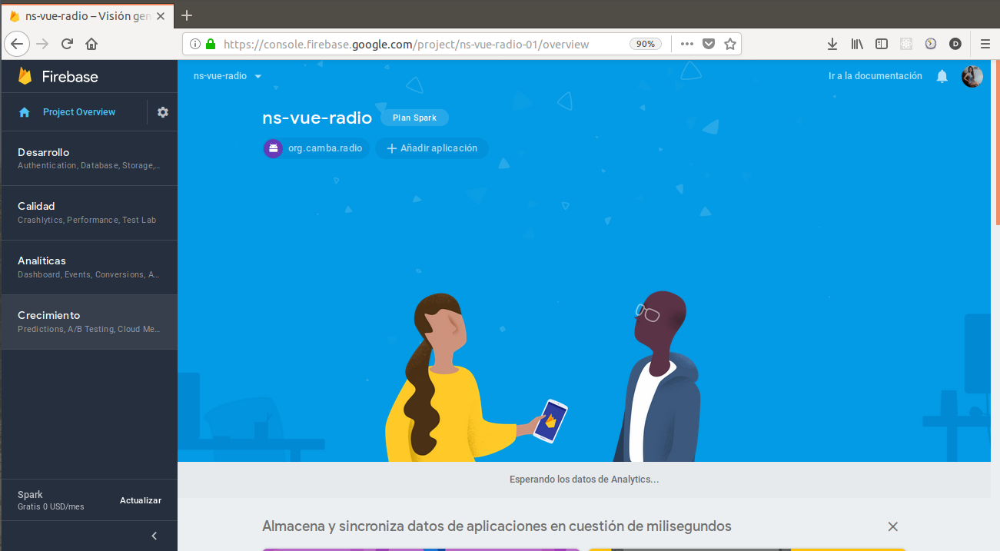
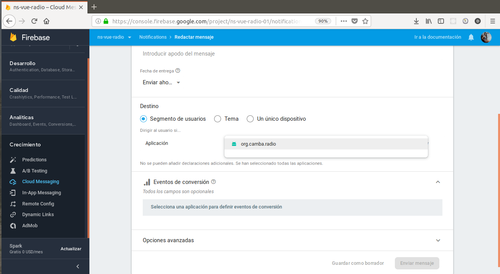
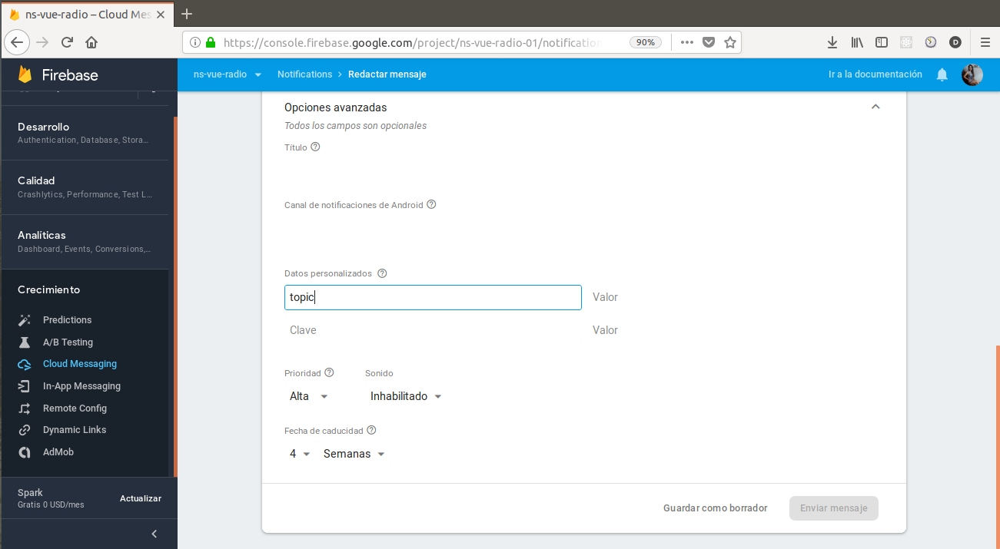
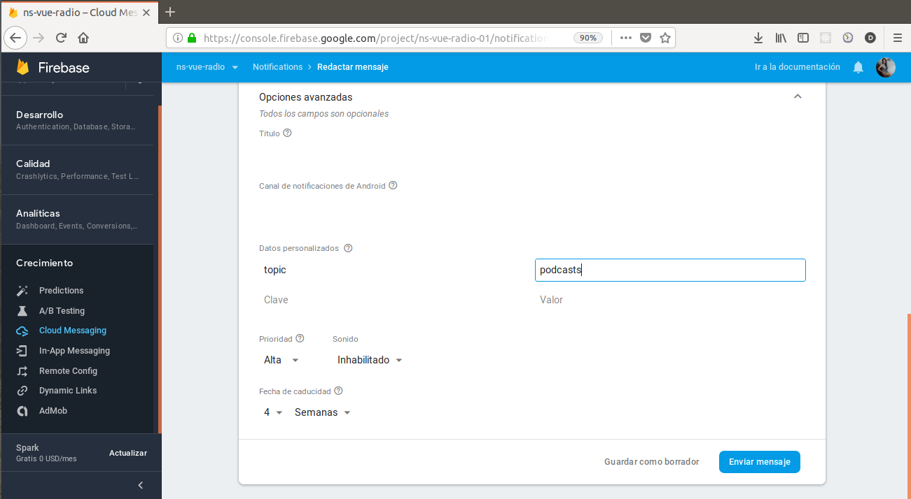

## Firebase Cloud Message

* Se necesita una [cuenta de Google](https://accounts.google.com/signup/v2/webcreateaccount?service=ahsid&continue=https%3A%2F%2Ffirebase.google.com%2F%3Frefresh%3D1&flowName=GlifWebSignIn&flowEntry=SignUp)

* Ir a [la consola](https://console.firebase.google.com/)

* Añadir el proyecto

* Continuar

* Crear proyecto

* Continuar

* Añadir una aplicacion android

* Nombre del paquete android(id de la aplicación): `org.camba.radio`
* Registrar aplicación

* Descargar el archivo `google-services.json`

* Ejecutar el comando:

`git clone http://gitlab.camba.coop/camba/ns-vue-radio.git ns-vue-radio`

* Copiar el archivo:

`google-services.json`

en

`ns-vue-radio/app/App_Resources/Android/`

* [Agregar nativescript-plugin-firebase](Guia-para-agregar-nativescript-plugin-firebase.md)

* Ejecutar los comandos:

`npm install`

`npm run clean`

`tns build android --bundle`

`tns run android --bundle`

* Una vez que la aplicación inició y se registró el Firebase

* Ir a Consola>Crecimiento>Cloud Messaging

* Escribir el texto del mensaje

* Seleccionar la aplicacion

* En las opciones avanzadas>datos personalizados

* Donde dice clave escribir: topic

* Donde dice valor escribir: el nombre del canal que se quiere que se muestre luego de ver el msj en la aplicacion (vivo, programacion, escribinos, podcasts, redes)

* Finalmente enviamos nuestra notificación

